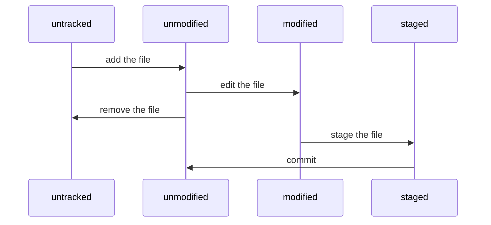

### 1.集中式与分布式

> Git 是**分布式**版本控制系统，而  SVN 属于**集中式**。
> SVN 是 subversion 的缩写

|  | 集中式（SVN） | 分布式（Git） |
| --- | --- | --- |
| 是否有中央服务器 | 有，开发人员需要从中央服务器获得最新版本的项目然后在本地开发，开发完推送给中央服务器。因此脱离服务器开发者是几乎无法工作的 | 无，开发人员本地都有 Local Repository |
| 网络依赖 |  必须要联网才能工作，而且对网络的依赖性较强，如果推送的文件比较大而且网络状况欠佳，则提交文件的速度会受到很大的限制 |  分布式在没有网络的情况下也可以执行 commit 查看版本提交记录、以及分支操作，在有网络的情况下执行 push 到 Remote Repository |
| 文件存储格式 | 按照原始文件存储，体积较大 | 按照元数据方式存储，体积很小 |
| 是否有版本号 | 有 | 无 |
| 分支操作的影响 | 创建新的分支则所有的人都会拥有和你一样的分支 | 分支操作不会影响其他开发人员 |
| 提交 | 提交的文件会直接记录到中央版本库 | 提交是本地操作，需要执行push操作才会到主要版本库 |

集中式版本控制只有中心服务器拥有一份代码，而分布式版本控制每个人的电脑上就有一份完整的代码。
集中式版本控制有安全性问题，当中心服务器挂了所有人都没办法工作了。
集中式版本控制需要连网才能工作，如果网速过慢，那么提交一个文件会慢的无法让人忍受。而分布式版本控制不需要连网就能工作。
分布式版本控制新建分支、合并分支操作速度非常快，而集中式版本控制新建一个分支相当于复制一份完整代码。

### 2.文件状态变化

文件状态变化周期：

- untracked：未跟踪, 此文件在文件夹中, 但并没有加入到git库, 不参与版本控制. 通过 git add  状态变为 Staged 。
- unmodify：**文件已经入库**, 未修改, 即版本库中的文件快照内容与文件夹中完全一致. 这种类型的文件有两种去处, 如果它被修改, 而变为 Modified 。 如果使用 git rm 移出版本库, 则成为   Untracked 文件  
- modified：文件已修改, 仅仅是修改, 并没有进行其他的操作. 这个文件也有两个去处, 通过 git add 可进入暂存 staged 状态, 使用 git checkout 则丢弃修改过,返回到 unmodify 状态, 这个git checkout即从库中取出文件, 覆盖当前修改   
- staged：暂存状态. 执行 git commit 则将修改同步到库中, 这时库中的文件和本地文件又变为一致, 文件为Unmodify状态. 执行 git reset HEAD filename 取消暂存,文件状态为 Modified
### 3.工作流
初始化一个仓库后，当前目录就成为了**工作区**，在工作区下会出现一个名为 .git 的目录，所有Git 需要的数据和资源都存放在 .git 目录下。

Git 的版本库有一个称为 Stage 的**暂存区**以及 History **版本库**，History 存储所有分支信息，使用一个 HEAD 指针指向当前分支，最后则为远端仓库去。