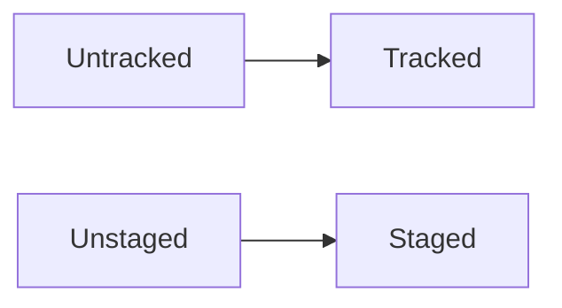
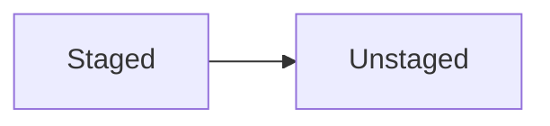

谢谢您的教程. 
不知道写点什么, 把自己学习的时候记的一些笔记贴出来吧!

## 基本用法

### git init

### git add

### git commit -m 

### git status

显示文件的git状态

## 版本穿梭

### git log

显示HEAD及其祖先的commid记录

### git reflog

显示HEAD的指向记录

### git reset --hard (HEAD^/commit_id)

版本穿梭

### git checkout -- file

放弃修改. 回退到Staged/commit状态. 

### git reset HEAD <file>

## 远程仓库

### git clone ... (dir_name)

克隆远程仓库(并改名)

### git remote add origin ...

关联远程仓库origin

### git remote rm <remote_name>

解除关联远程仓库

### git push remote_name branch

向远程仓库推送分支

### git pull remote_name branch

从远程仓库拉取分支

### git fetch remote_name branch

从远程仓库拉取并合并分支

## 分支管理

### git branch 

列出所有分支

### git branch branch_name

创建分支

### git switch <branch_name> (最新版)/ git checkout <branch_name>

切换分支

### git merge <branch_name>

合并分支到当前分支

### git merge --abort

冲突时, 取消本次合并

### git branch -d <branch_name>

删除分支

### git stash

临时保存工作区

### git cherry-pick

**git cherry-pick commit_id**

将特定的commit再提交一遍, 常用于bug修改

### git rebase

强行整理log. **慎用**, 可能会和别处已有记录冲突. 

## 分支管理策略

### master

master分支用来发布稳定版本

### dev

dev分支是项目的所有代码, 但不稳定, 当有稳定版本是合并到稳定版本

### --no-ff

eg: **git merge --no-ff -m "..." dev**. 

禁止fast forward合并

## 标签管理

### git tag

列出所有标签

### git tag <tag_name>

为当前分支最新commit打上标签

### git tag  <tag_name> <commit_id>

为特定的commit打上标签

### git tag -a <tag_name> -m "..." <commit_id>

添加标签的同时加上注释

### git tag -d <tag_name>

删除本地标签

### git push origin <tag_name>

推送标签

### git push origin --tags

推送所有标签

### git push origin :/regs/tags/<tag_name>

删除标签

