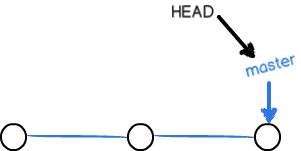
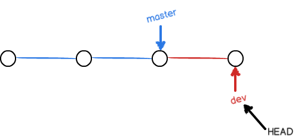
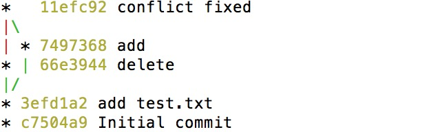

#Git笔记
---
### 1. 工作区（Working Directory）和版本库（Repository）
 
	

	
**说明：**

* 工作区就是创建仓库的文件夹如（learngit文件夹就是一个工作区）
* 版本库就是工作区的隐藏目录`.git`,版本库中有暂存区（stage/index）和分支（master）
* git add 实际是把文件添加到暂存区， git commit 把暂存区的内容提交到当前分支

### 2.创建版本库

1. 创建git仓库文件夹，名为：`learngit` 
	
		$ mkdir learngit
	
2. 进入leadngit文件夹

		$ cd learngit
3. 初始化git仓库	
		
		$ git init 
		
### 3. 添加文件
1. 在`leangit`下添加一个`readme.txt`文件，并编辑一些内容

2. 添加到仓库暂存区（）在暂存区 文件会变绿

		$ git add readme.txt	
3. 提交readme.txt文件到当前分支, -m "提交说明"(只有进行 git add 后 go commit 命令才有效)

		$ git commit -m "add readme.txt"		
		
### 4. 修改文件
#### 4.1 当文件在工作区时
1. 查看readme.txt文件内容

		$ cat readme.txt
2. 修改readme.txt文件内容

3. 查看仓库状态

		$ git status
		
4. 添加到仓库暂存区，并提交到分支
		
		$ git add readme.txt
		$ git commit -m "modify readme.txt"
		
#### 4.2 当文件在暂存区时
1. 修改文件内容
2. 添加到仓库暂存区

		$ git add readme.txt
3. 提交到分支

		$ git commit -m "modify readme.txt at the stage"		

### 5. 撤销修改文件（未提交到分支）
#### 5.1 当文件在工作区时
1. 执行撤销命令

		$ git checkout -- readme.txt
		
#### 5.2 当文件在暂存区时
1. 令文件回到工作区

		$ git reset HEAD readme.txt
2. 执行撤销命令

		$ git checkout -- readme.txt
		
### 6. 版本控制（无限次后悔）

说明：在Git中，`HEAD`表示当前版本，`HEAD^`表示上一版本 `HEAD^^`表示上上一个版本

1. 查看提交日志输出(完整版)
	
		$ git log 

2. 查看提交日志输出（精简版）

		$ git log --pretty=noline
	
3. 回到上一版本
	
		$ git reset --hard HEAD^
		
4. 回到指定版本（hard 后面添加版本号）

		$ git reset --hard ea34578
	
5. 查看命令历史

		$ git reflog
		

### 7. 远程仓库（github）
#### 7.1 添加到远程库
1. 在github上创建一个名为`learngit`的空仓库
2. 在本地`learngit`仓库下运行命令

		$ git remote add origin git@github.com:iphone5solo/learngit.git
3. 把本地内容推送到github远程库上(第一次push 参数带 `-u` 关联远程仓库)

		$ git push -u origin master
		
注意：如果在git push -u origin master时出现以下错误，证明电脑没有修改远程仓库的公钥，
 	
		
	Permission denied (publickey).
	fatal: Could not read from remote repository.
	
	Please make sure you have the correct access rights
	and the repository exists.
	
解决方法：

1. 在github上点击`Edit profile` --> `SSH and GPG keys` --> `new SSH key` 添加SHH公钥
2. 打开`id_rsa.pub`文件（/Users/iphone5solo/.ssh/id.rsa.pub）
3. 将`id_rsa.pub`文件内容拷贝到key就可以了，title随便填。

#### 7.2 从远程库克隆
1. 在github上创建一个名为`clonegit`的仓库
2. 使用命令克隆仓库
		
		$  git clone git@github.com:iphone5solo/clonegit
		
#### 7.3 从远程仓库更新本地仓库（已关联）
	
		$ git pull origin master
		
### 8. 分支管理
**图文说明：**

`master`分支是一条线，git用`master`指向最新的提交，在用`HEAD`指向`master`，以此才确定当前分支，和提交点。

 
**1. 创建分支**

当我们创建新的分支，例如`newBranch`,git就会新建一个指针`newBranch`,指向`master`相同的提交，再把`HEAD`指向`newBranch`,就表示当前分支在`newBrach`上

 
**2. 新分支的修改和提交**

现在对工作区的修改和提交就是针对`newBranch`分支了，比如新提交一次后，`newBranch`指针就向前移动一步，指向最新提交，而`master`指针指向不变。

 
**3. 分支的合并**

把`newBranch`合并到`master`上，直接把`master`指向`newBranch`的当前提交，就完成了合并。

 
**4. 合并完成删除分支**

删除分支`newBranch`，就剩下一个`master`分支

 
**5. 查看分支合并图解**

 
**关于分支的主要命令如下**

* 查看分支

		$ git branch
* 创建`newBranch`分支

		$ git branch newBranch
* 切换`HEAD`指向`newBranch`分支

		$ git checkout newBranch
* 创建+切换分支
		
		$ git checkout -b newBranck
* 合并某分支到当前分支

		$ git merge newBranch
* 普通删除`newBranch`分支
	
		$ git branch -d newBranch
		
* 强行删除`newBranch`分支

		$ git branch -D newBranch
		
* 查看分支合并状况

		$ git log --graph --pretty=oneline --abbrev-commit
		
### 9. 藏匿当前未提交的分支

如： 当前在修改自己的分支`dev`,突然项目经理要求修复一个bug-07

解决方法： 

1. 藏匿当前`dev`分支的工作状态

		$ git stash
2. 新建一个`bug-07`分支

		$ git branch -b bug-07
3. 修复bug并提交，合并`bug-07`到`master`分支
	
		$ git commit -m "fix the bug-07"
		$ git checkout master
		$ git merge --no-ff -m "merge  bug-07" bug-07
	
4. 删除`bug-07`分支

	    $ git branch -d  bug-07
5. 查看当前`stash`

		$ git stash list
6. 恢复`dev`分支的工作状态，并删除stash内容

		$ git stash pop 
	
### 10. 多人协作

* 查看远程库信息

		$ git remote
	
 * 详细查看远程信息
 
 		$ git remote -v
 		
 * 推送分支到远程库
 
		$ git remote origin master
		
 * 抓取远程分支
 
 		$ git pull origin master
 		
 		
### 11. 标签管理
 
 * 创建一个标签，默认为`HEAD`当前分支添加标签
 	
 		$ git tag v1.0
 	
 * 为版本号为`e8b8ef6`添加`v2.0`标签
 
 		$ git tag v2.0 e8b8ef6
 		
 * 为版本号为`6cb5a9e`添加带有说明的标签，`-a`指定标签名,`-m`指定说明文字
 
 		$ git tag -a v3.0 -m "version 0.2 released" 6cb5a9e
 	
 * 根据标签查看指定分支
 		
 		$ git show v0.2
 * 查看所有标签
 
 		$ git tag
 		
 * 删除`v1.0`标签
 
 		$ git tag -d v1.0
 	
 * 把`v0.9`标签推送到远程
 
 		$ git push origin v0.9
 		
 * 推送所有尚未推送到远程的本地标签
 
 		$ git push origin --tags
 		
 * 删除远程标签, 先删除本地标签，再删除远程标签
 		
 		$ git tag -d v0.9
 		$ git push origin :refs/tags/v0.9